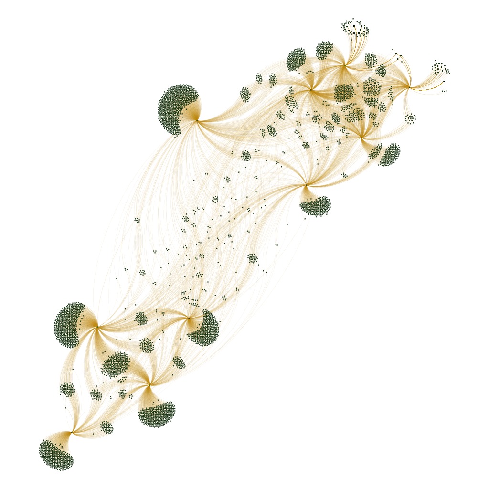

# Working with the COVID-19 Open Research Dataset

This page describes how to use Pyserini's Collection API to work with the [COVID-19 Open Research Dataset (CORD-19)](https://pages.semanticscholar.org/coronavirus-research) from the [Allen Institute for AI](https://allenai.org/).
This API provides access to the raw collection, independent of search.
If you want to actually search the collection, consult [this guide](https://github.com/castorini/anserini/blob/master/docs/experiments-cord19.md).

## Data Prep

The latest distribution available is from 2020/05/26.
First, download the data:

```bash
DATE=2020-05-26
DATA_DIR=./collections/cord19-"${DATE}"
mkdir "${DATA_DIR}"

wget https://ai2-semanticscholar-cord-19.s3-us-west-2.amazonaws.com/"${DATE}"/document_parses.tar.gz -P "${DATA_DIR}"
wget https://ai2-semanticscholar-cord-19.s3-us-west-2.amazonaws.com/"${DATE}"/metadata.csv -P "${DATA_DIR}"

ls "${DATA_DIR}"/document_parses.tar.gz | xargs -I {} tar -zxvf {} -C "${DATA_DIR}"
rm "${DATA_DIR}"/document_parses.tar.gz
```

## Collection Access

The following snippet of code allows you to iterate through all articles in the collection (note that although we use the `Cord19AbstractCollection`, `raw` _does_ provide access to the full text:

```python
from pyserini.collection import pycollection

collection = pycollection.Collection('Cord19AbstractCollection', 'collections/cord19-2020-05-26')

cnt = 0;
full_text = {True : 0, False: 0}

articles = collection.__next__()
for (i, d) in enumerate(articles):
    article = pycollection.Cord19Article(d.raw)
    cnt = cnt + 1
    full_text[article.is_full_text()] += 1
    if cnt % 1000 == 0:
        print(f'{cnt} articles read...')
```

The above snippet of code tallies the number of full-text articles in the collection.

CORD-19 comes in two parts, `metadata.csv` and the actual full-text JSON (if available).
What this code gives you is a JSON that has both integrated, along with a bunch of convenience methods.
For full-text articles, i.e., `is_full_text()` returns `True`, the metadata are provided with the `metadata()` method.
For articles without full text, only the metadata are available.

Let's examine the first full-text article in the collection:

```python
from pyserini.collection import pycollection

# All this snippet of code does is to advance to the frist full-text article:
collection = pycollection.Collection('Cord19AbstractCollection', 'collections/cord19-2020-05-26')

articles = collection.__next__()
article = None
for (i, d) in enumerate(articles):
    article = pycollection.Cord19Article(d.raw)
    if article.is_full_text():
       break

# Now article contains the first full-text article.

# Let's print basic information:
print(f'cord_uid {article.cord_uid()}, full-text? {article.is_full_text()}')
print(f'title: {article.title()}')
print(f'abstract: {article.abstract()}')

# We can fetch the matadata:
metadata = article.metadata()

# For example, the DOI:
print(f'DOI: {metadata["doi"]}')

# The body() method returns an array of str corresponding to the full text.
print(f'The full text contains {len(article.body())} paragraphs')

# If you really want to manipulate the raw JSON:
article.json
```

For an article that does not contain full text, all the above methods behave the same way, except that `body()` returns an empty array.


## Load Data Into Neo4j

The easiest way to get started with Neo4j and start an instance is to [download the Neo4j desktop](https://neo4j.com/download-center/).

In the desktop app create a new project and add a database (create local graph). Give it any name and password and use Neo4j version `4.0.4`. The click "start" to start running database locally.

Once you have the [Pyserini development environment](https://github.com/castorini/pyserini#development-installation) setup run the `extract_citation_graph.py` script in the root of the pyserini project. For example:
```
python extract_citation_graph.py --path path/to/cord19
```

Due to security reasons Neo4j only allows Cypher queries to acess files in certain directories. Move the generated csv files, `node.csv` and `edge.csv` to the import directory of Neo4j. Follow [this guide](https://neo4j.com/docs/operations-manual/current/configuration/file-locations/) to find the import directory on your machine.


To load the csv files into Neo4j run the following Cypher queries in the Neo4j Browser.

Create a unique constraint on `cord_uid` to improve lookup time:
```
CREATE CONSTRAINT cord_uid ON (n:PUBLICATION) ASSERT n.CordUID IS UNIQUE;
CREATE CONSTRAINT pmcid ON (n:PUBLICATION) ASSERT n.PMCID IS UNIQUE;
CREATE CONSTRAINT title ON (n:PUBLICATION) ASSERT n.Title IS UNIQUE;
```

Create article nodes for full-text papers in CORD-19. Try to merge on paper_id. If the article is from PMC the paper_id is a pmcid, otherwise it is a hash.
```
LOAD CSV WITH HEADERS FROM 'file:///articles.csv' AS row
MERGE (a:PUBLICATION {PMCID:row.pmcid})
SET a.CordUID = row.cord_uid, a.Title = left(row.title, 500)
```

Create nodes for all the cited articles.
```
:auto USING PERIODIC COMMIT 1000
LOAD CSV WITH HEADERS FROM 'file:///edges.csv' AS row
MERGE (cited:PUBLICATION {Title:row.target_title})
WITH row, cited WHERE cited.DOI IS NULL AND row.doi IS NOT NULL
SET cited.DOI = row.doi;
```

Create citations for cited papers.
```
:auto USING PERIODIC COMMIT 1000
LOAD CSV WITH HEADERS FROM 'file:///edges.csv' AS row
MATCH (article:PUBLICATION {CordUID:row.cord_uid})
MATCH (cited:PUBLICATION {Title:row.target_title})
CREATE (article)-[r:BIB_REF]->(cited)
```

Run a test query, return the top 10 cited articles:
```
MATCH (a)<-[r:BIB_REF]-(b) WITH a, count(r) as num_cites RETURN a ORDER BY num_cites DESC LIMIT 10
```
## Stream Into Gephi

Install Gephi from [this link](https://gephi.org/users/install/) and create a new project.

Install APOC in Neo4j and Graph Streaming in Gephi. In Gephi, right click on `Master Server` and select `Start` 

Stream into Gephi.
```
MATCH (a)<-[r:BIB_REF]-(b) WITH a, count(r) as num_cites
WITH a ORDER BY num_cites DESC LIMIT 10
MATCH path = ()-->(a)
call apoc.gephi.add(null,'workspace1', path, 'weightproperty', ['CordUID','Title','DOI']) yield nodes, relationships
return nodes, relationships
```
From the Layout panel in Gephi, choose `ForceAtlas 2` algorithm and tune the `scaling` parameter for a better graph spatialization.

You should get the following visualization:

## Replication Log

+ Results replicated by [@Dahlia-Chehata](https://github.com/Dahlia-Chehata) on 2020-12-26 (commit [`b6da95a`](https://github.com/castorini/pyserini/commit/b6da95aaf81ebb26d51be5c7f2cf68b44361307b))
